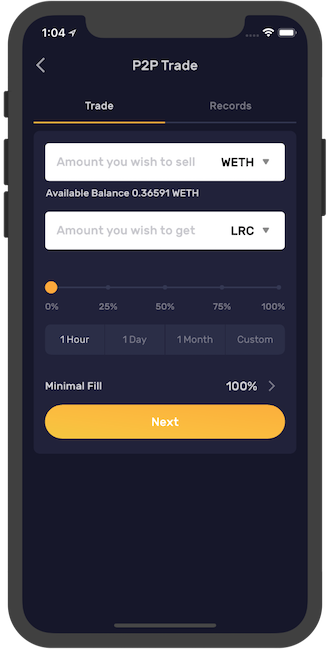

# loopr-ios

### Download
You can download the app on
[https://loopring.io/mobile](https://loopring.io/mobile)




### Design
Please refer
[https://www.dropbox.com/s/znhbbdszw63lq4c/loopring_ios_0317.zip?dl=0](https://www.dropbox.com/s/znhbbdszw63lq4c/loopring_ios_0317.zip?dl=0)

### Development 

##### Stack

- No storyboard. It's ok to use xib in the early development. However, if the UI is complicated, please write UI programmatically.
- No subclassing any class in UIKit. We try to keep the code simple. It's better to use extensions.
- No ReactiveSwift. Keep it simple. We prefer to use Cocoa Touch directly.
- No SnapKit at this time.
- [Lottie](https://github.com/airbnb/lottie-ios): an iOS library to natively render After Effects vector animations
- [Pop](https://github.com/facebook/pop): An extensible iOS and OS X animation library, useful for physics-based interactions.
- [SwiftLint](https://github.com/realm/SwiftLint): A tool to enforce Swift style and conventions.
- [SwiftTheme](https://github.com/jiecao-fm/SwiftTheme): Powerful theme/skin manager

##### Tools
- Xcode Version 9.2 (9C40b)
- Swift Apple Swift version 4.0.3 (swiftlang-900.0.74.1 clang-900.0.39.2)
- CocoaPods 1.5.0

##### Start
1. Install cocoapods ```sudo gem install cocoapods```
1. ```pod install```
2. Open ```loopr-ios.xcworkspace```
